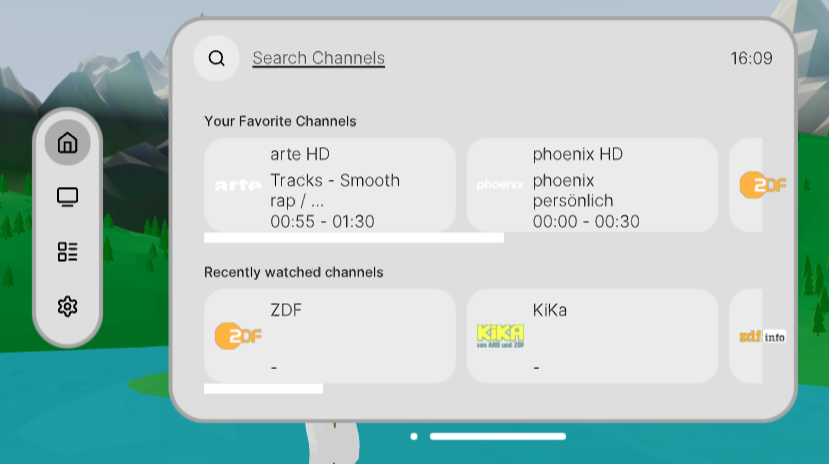
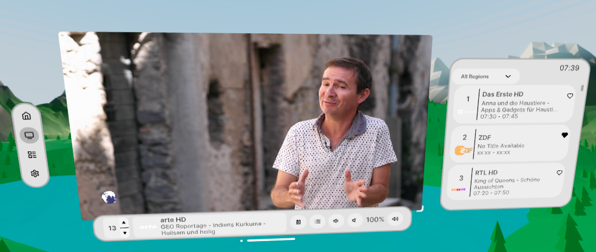
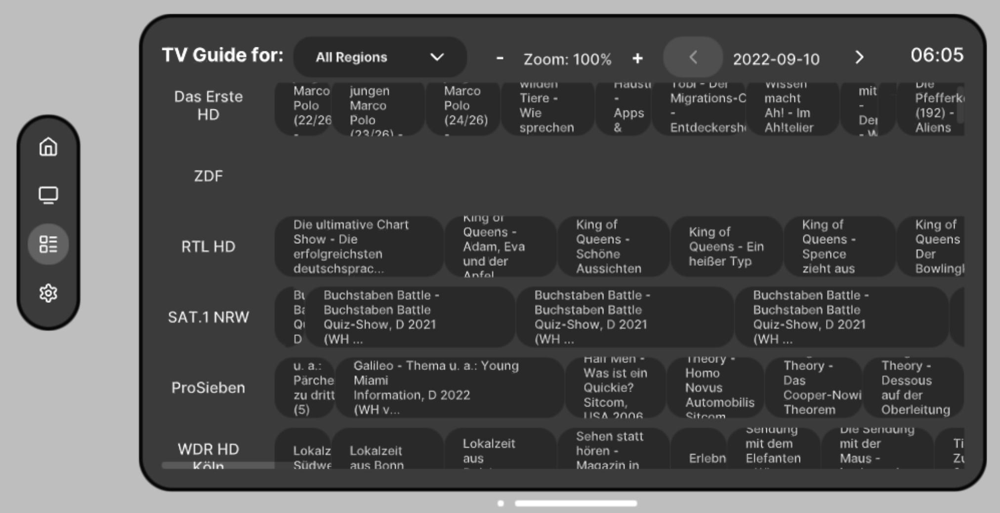
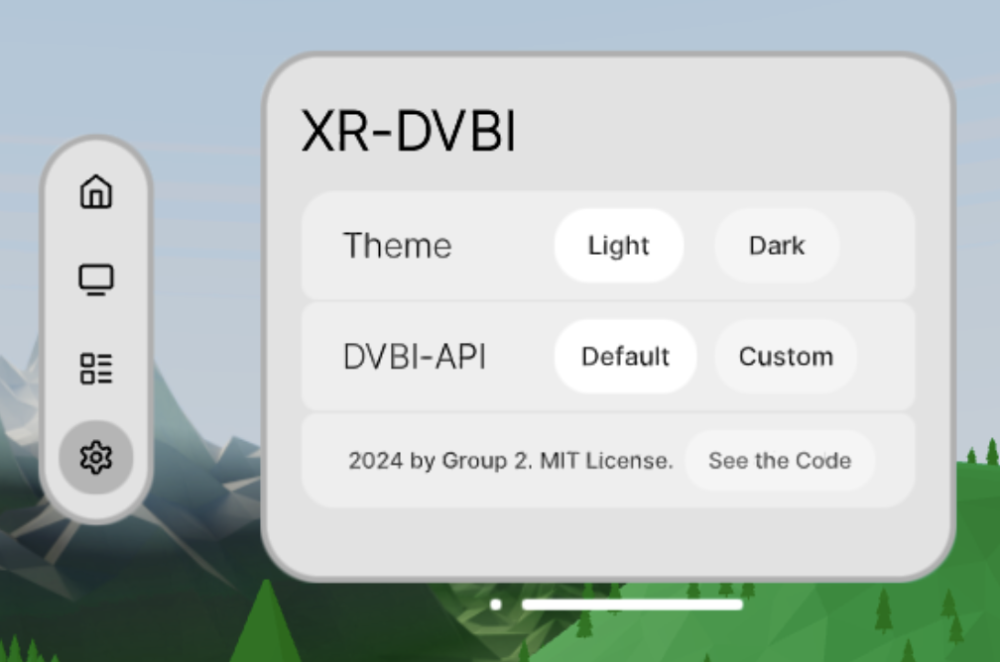

# XR-DVBI

A project that aims to bring television over the internet to the XR world using the DVB-I standard and WebXR. This project is part of the Advanced Web Technologies course at TU-Berlin.

## Table of Contents
- [XR-DVBI](#xr-dvbi)
  - [Table of Contents](#table-of-contents)
  - [Technologies](#technologies)
  - [Repository Structure](#repository-structure)
  - [Running the app](#running-the-app)
    - [Prerequisites](#prerequisites)
    - [Installation and Running Locally](#installation-and-running-locally)
  - [Functionality and Features](#functionality-and-features)
    - [Demo Screenshots](#demo-screenshots)

## Technologies
The project is built using the following technologies:

Both the library and the app use [TypeScript](https://github.com/microsoft/TypeScript). The library has quite a minimal tech stack and only uses a small amount of additional dependencies.

The app, however, uses a more complex tech stack that includes:
- [Vite](https://github.com/vitejs/vite) + [React](https://github.com/facebook/react)
- [three.js](https://github.com/mrdoob/three.js/)
- [@react-three/xr](https://github.com/pmndrs/xr)
- [uikit](https://github.com/pmndrs/uikit)

## Repository Structure
This repository is subdivided into the sub-projects of the DVB-I library (`lib/`) and the xr app (`app/`). Find instructions on how to run and use the sub-projects in the respective READMEs.
Additionally, small intermediate demos and prototypes can be found in the `demos/` directory. Please note, however, that these demos are not maintained and not a part of the final project.

## Running the app
These instructions are for running the app locally. For instructions on how to deploy the app to a server, please refer to the `app/` README. No backend is necessary to do that other than a simple web server that can serve the *HTML* and *JS* files.

### Prerequisites
- Node.js
- npm
- A modern web browser that supports WebXR
- A DVB-I service list that is hosted on a URL that is reachable for you. Currently no public service list is provided and local files are not supported.

### Installation and Running Locally
1. Clone the repository
2. Navigate to the `app/` directory
3. Create a `.env` file in the `app/` directory and add the following line:
```
API_URL=<URL to the DVB-I service list>
```
4. Run `npm i` to install the necessary dependencies
5. Run `npm run dev` to start the development server
6. Open your browser and navigate to `https://localhost:3000` and accept the self-signed certificate
7. You should now see the app running locally. If you don't see anything, check the console for errors.
8. You can test the app just using the mouse without entering a virtual environment but also in VR/AR using either a compatible headset or an emulator.
9. **Important:** The default *[Immersive Web Emulator](https://github.com/meta-quest/immersive-web-emulator/)* **isn't supported**! However, a default emulator is provided. Click on the "Enter VR" or "Enter AR" button to enter the respective mode. If this isn't working, try to activate the emulator manually using `Cmd/Ctrl + Option/Alt + E` and then enter the VR/AR mode again. While this should work also on non-localhost deployments, from our testing it seems that the emulator is not always working as expected. On `localhost` it should work fine.
The emulator contains many features and is subject to change, so we will not give details for its usage here. Features supported include pressing buttons (and holding them at certain points), using the thumbsticks, using the mouse to control the controllers including the camera and moving around the scene, and more. See the relevant [GitHub Issue](https://github.com/pmndrs/xr/issues/319).

These instructions are for running the app locally and creating a development server. This supports hot-reloading and can be immediately used to test changes. For deployment, please refer to the `app/` README.

## Functionality and Features
The app allows users to browse a DVB-I service list and watch live TV channels in a WebXR environment. The app supports the following features:
- A **Home View** with recently watched and favorite channels. It also contains a search function for all available channels using a virtual keyboard.
- A **TV View** that plays the selected channel in a virtual TV screen. The user can change the channel, adjust the volume, and mute the sound, pause and unpause the playback and resize the TV screen.
- A **Guide View** that shows the EPG for all available channels. Here the user can see the current and upcoming programs for each channel, scroll through the EPG, and select a channel by either clicking on a program or the channel itself. The guide can be zoomed in and out and switched between days using the respective buttons in the UI.
- A **Settings View** that allows the user to change between a light and dark theme and change the window movement mode. For more details, please refer to the `app/` README.

In each view the main window can be moved using the bottom bar of the window. Furthermore, an immersive mode displaying a virtual low-poly landscape can be toggled using the small circle to the left of the bottom bar for each view. It is especially useful when using the app in AR mode to quickly switch between being able to see the real world and being fully immersed in the virtual world.


### Demo Screenshots

The Home View

The TV View

The Guide View

The Settings View