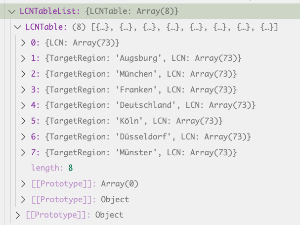

# DVBIlib
*A library allowing for retrieval and parsing of DVBI service descriptions*

- The name can be changed if for example libDVBI is deemed to sound nicer :)

## Getting Started
The project was created following [this](https://www.tsmean.com/articles/how-to-write-a-typescript-library/) tutorial.  

To get started:
- Install the dependencies with `npm i`.
- Create a `config.json` file in the `src` directory and fill out the values.
  - Use the `config.example.json` as a guide.

You can:
- Expose functions you want to be exported from the module by exporting them from the `index.ts` file
- Write tests for parts of the application using jest, in any folder named "tests". Run these tests using `npm test`.
  - There is an example test written for "hello world", which you can take a look at

## Notes
- Right now, only hello world is implemented. I put this here to test the testing and CI. When we actually have working functionality, we can of course remove this.

## Structure of the Data
Refer to [A177r6_Service-Discovery-and-Programme-Metadata-for-DVB-I_Draft_TS-103-770-v121_February-2024](https://dvb.org/wp-content/uploads/2023/07/A177r6_Service-Discovery-and-Programme-Metadata-for-DVB-I_Draft_TS-103-770-v121_February-2024.pdf) for the structure of our data.

We do the request to our end-point, get back an xml, which a parser than puts into a json. The data we get back here is not perfect yet. Especially, there seems to be a lot of instances where we have a structure like this:  
  
where a property contains an object that iself just contains a list/a string and nothing else. We probably want to flatten the hierachy there.

### Have-Struktur:
- Data
  - ServiceList: ServiceList
    - Name: string
    - ProviderName: string
    - ContentGuideSourceList: *Monoobject*
      - ContentGuideSource: ContentGuideSource[]
        - @CGSID: string // the id of the content source guide
        - ProviderName: string
        - ScheduleInfoEndpoint: EndpointInfo
          - @_contentType: string // is always going to be application/xml
          - URI: string
        - ProgramInfoEndpoint:EndpointInfo // OPTIONAL
          - @_contentType: string // is always going to be application/xml
          - URI: string
    - LCNTableList: *Monoobject* // OPTIONAL
      // LCN definition: `An LCN (Logical Channel Number) Table describes the arrangement or assignment of channels in a digital TV or other broadcasting systems. It is used to organize how the channels are displayed to the viewer, often in numerical order for easy navigation.`
      // Note: IRL, the first entry of the LCNTable list just has the LCN field set, all others have a region and then the LCN
      - LCNTable: LCNTable[] // Note: everything in LCNTable is optional lol
        - LCN: LCN[]
          - @_channelNumber: int
          - @_serviceRef:string // refers to the unique id of a service
        - TargetRegion: string
    - RegionList: *Monoobject*
      - -@_version: int = 1
      - Region: Region[]
        - RegionName: string
        - PostcodeRange: PostcodeRange[] // Optional
          - @_from: int
          - @_to: int
        - @_region_ID: string // often same as name
    - Service: Service[] // OPTIONAL
      - @_version: int = 1
      - UniqueIdentifier: string
      - ServiceName: string // EG "Das erste HD"
      - ProviderName: string // EG ARD
      - ContentGuideServiceRef: string // Optional, in my experience identical to UniqueIdentifier
      - ContentGuideSourceRef: string // Optional
      - ServiceType: *Monoobject*
        - @_href: string // refers to type official definition of type of content, not to content itself
      - RelatedMaterial: RelatedMaterial[]
        - HowRelated: *Monoobject*
          - @_href: string // eg `"urn: tva:metadata: cs :HowRelatedCS: 2012:19"`, don't ask me what that means
        - MediaLocator: *Monoobject*
          - "tva:MediaUri": tvaMediaUri
            - @_contentType: string // eg `image/png`. `application/vnd.dvb.ait+xml` is for HbbTV I think
            - #text:string // a url to the content
      - ServiceInstance: ServiceInstance[] 
        - @_priority: int
        // Note: Each element of the list will have ONE of the properties below
        - DASHDeliveryParameters: *Monoobject** // THIS IS THE ONE WE NEED FOR DASH
          - @_contentType: string // look for `application/dash+xml` to get what we want!
          - URI: string
        - DVBTriplet: *Monoobject*
          - ... (Not important for us)
        - DVBTDeliveryParameters: *Monoobject*
          - ... (Not important for us)

Note: I marked objects that only have 1 property and thus should be flattened *Monoobject*